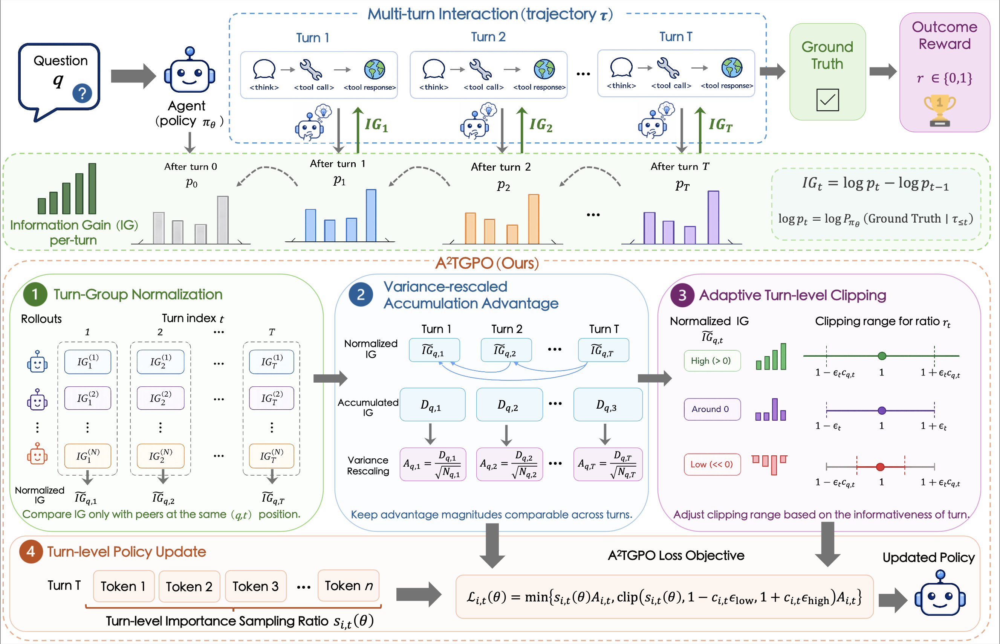

<h1 align="center" style="margin-top: 10px;">A<sup>2</sup>TGPO: Agentic Turn-Group Policy Optimization with Adaptive Turn-level Clipping</h1>


<div align="center"> 

[](https://arxiv.org/abs/2605.06200)
[](https://huggingface.co/papers/2605.06200)
<!-- [](https://swanlab.cn/@yux1ang/Tree-GRPO/overview) -->

</div>

<!-- ## News
- [Sep 25, 2025]: Codebase released. (work in progress) -->

## Table of contents

- [Overview](#overview)
- [Quick start](#quick-start)
- [Acknowledgement](#acknowledgement)
- [Citation](#citation)


## Overview
we propose **A<sup>2</sup>TGPO** (**A**gentic **T**urn-**G**roup **P**olicy **O**ptimization with **A**daptive Turn-level Clipping), which retains IG as the intrinsic signal but re-designs how it is normalized, accumulated, and consumed: (i) **turn-group normalization**: normalizes IG within each (prompt, turn-index) group so that each turn is compared only against peers at the same interaction depth; (ii) **variance-rescaled discounted accumulation**: divides cumulative normalized IG by square root of accumulated terms to keep advantage magnitudes comparable across turn positions; and (iii) **adaptive turn-level clipping**: modulates each turn's clipping range based on its normalized IG, widening the update region for informative turns and narrowing it for uninformative ones.

<p align="center">
  
  <i>
  The overview of A<sup>2</sup>TGPO framework.
  </i>
</p>

## Quick Start

### Local Retriever Tool Initialization

#### Environment
```bash
conda create -y -n retriever python=3.10
conda activate retriever
conda install -y pytorch==2.4.0 torchvision==0.19.0 torchaudio==2.4.0 pytorch-cuda=12.1 -c pytorch -c nvidia
pip install transformers datasets pyserini
conda install -y -c pytorch -c nvidia faiss-gpu=1.8.0
pip install uvicorn fastapi
```

#### Download Retriever Data
```bash
save_path=/the/path/to/save
python rag_server/download.py --save_path $save_path
cat $save_path/part_* > $save_path/e5_Flat.index
gzip -d $save_path/wiki-18.jsonl.gz
```

#### Initialize Retriever API
```bash
conda activate retriever
# edit save_path in rag_server/launch.sh
bash rag_server/launch.sh
```

### Dataset
```bash
# Process training set of multi-hop QA benchmarks
python data_process/hotpotqa_multihop_train.py
# Process test set of multi-hop QA benchmarks
python data_process/multihop_test_merge.py
# Process training set of single-hop QA benchmarks
python data_process/nq_singlehop_train.py
# Process test set of single-hop QA benchmarks
python data_process/singlehop_test_merge.py
```


### Training Environment Installation

```bash
#create env
conda create -n atgpo python==3.10
conda activate atgpo

# install torch & flash-atten
pip3 install torch==2.6.0 --index-url https://download.pytorch.org/whl/cu124
pip3 install flash-attn --no-build-isolation

# install RL basic env
cd ATGPO

# This is our RL env freeze file. You can install it as a supplement or use it for checking.
pip install -r requirements.txt

```

### RL Training

Run A<sup>2</sup>TGPO training with Qwen3-4B on multi-hop QA setting.
```bash
conda activate atgpo
bash ATGPO/scripts/ATGPO_multihop_qwen3_4B.sh
```

## Acknowledgement
The codebase is built upon [veRL](https://github.com/volcengine/verl).
The implementation is inspired by [AEPO](https://github.com/RUC-NLPIR/ARPO).
We express our gratitude to these open-source projects.

## Citation
```bibtex
@misc{chen2026a2tgpoagenticturngrouppolicy,
      title={A$^2$TGPO: Agentic Turn-Group Policy Optimization with Adaptive Turn-level Clipping}, 
      author={Dingwei Chen and Zefang Zong and Zhipeng Ma and Leo Luo and Yang Li and Chengming Li and Peng Chen and Jie Jiang},
      year={2026},
      eprint={2605.06200},
      archivePrefix={arXiv},
      primaryClass={cs.CL},
      url={https://arxiv.org/abs/2605.06200}, 
}
```
