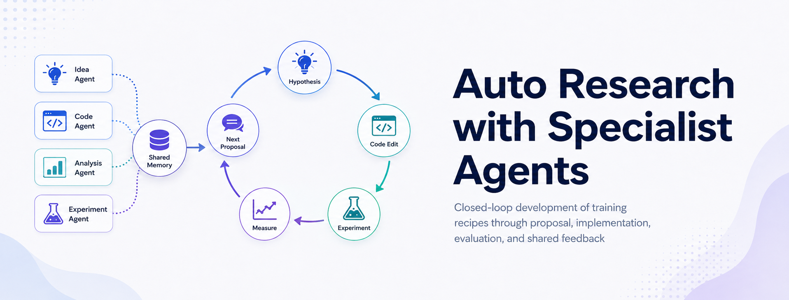

<div align="center">

# Auto Research with Specialist Agents Develops Effective and Non-Trivial Training Recipes



[](https://arxiv.org/abs/2605.05724)
[](LICENSE)

**Auto Research**: a closed-loop harness that lets specialist language agents propose, run, and refine training recipes under real measurement. <br>
3 reference environments · 6 packages · evaluator-owned scoring

</div>

Auto research runs as a closed empirical loop. Each iteration submits an executable training-recipe edit, an external evaluator measures the result, and the next iteration uses that measurement as feedback. This repository contains the harness, the task adapter contract, and four reference task packages plus two single-agent variants that exercise the loop on real GPU training recipes.

## Layout

| Path | Role |
| --- | --- |
| `agent_core/` | Task-agnostic harness. Blackboard, supervisor loop, agent SDK wrapping, MCP tools. |
| `multi_agent_pg/` | Parameter Golf. Ten specialist agents over `train_gpt.py`. |
| `multi_agent_cifar/` | CIFAR-10 Airbench96. Five specialists over `airbench96.py` under a strict 0.96 accuracy gate. |
| `multi_agent_nc/` | NanoChat-D12. Five specialists over a vendored nanochat tree. |
| `single_agent_pg/` | One-generalist variant of Parameter Golf. Peer of `multi_agent_pg`. |
| `multi_agent_generic_pg/` | Ten generic agents on Parameter Golf. Peer of `multi_agent_pg`. |
| `docs/` | Architecture overview and task adapter contract. |
| `release_artifacts/` | Frozen run records for each reported experiment (results.tsv, tree.tsv, best.json, KNOWLEDGE.md, LEADERBOARD.md, per-keep/final code snapshots, plus two example lineage prompts). See [`release_artifacts/README.md`](release_artifacts/README.md). |

## Requirements

This repository is developed and tested on Linux. The `single_agent_pg/` and `multi_agent_generic_pg/` variants share `train_gpt.py`, `run_trial.sh`, and `knowledge/` with `multi_agent_pg/` through filesystem symlinks, which require a Linux or macOS git checkout. Windows users would need to materialise the symlinks manually before running the variants.

The reference recipes assume an eight-GPU node available locally. An Anthropic API key is required for the Claude Agent SDK.

## Usage

```bash
cp .env.example .env                  # fill ANTHROPIC_API_KEY
pip install -e .

# Prepare task data under ./data/<task>/ as documented in each task README.
# Then start a Parameter Golf supervisor:
python -m multi_agent_pg.supervisor --state-root ./magent_state_pg
```

CIFAR and NanoChat-D12 supervisors follow the same pattern with their own state roots. Each task package ships its own `dashboard.py` for live trace inspection. See `docs/architecture.md` for the system overview and `docs/task_adapter.md` for the contract a new task package must implement.

## Citation

```bibtex
@inproceedings{autoresearch2026,
  title  = {Auto Research with Specialist Agents Develops Effective and Non-Trivial Training Recipes},
  author = {Anonymous Authors},
  year   = {2026},
}
```

## License

Apache-2.0. See `LICENSE`. The vendored nanochat tree under `multi_agent_nc/vendor/nanochat/` is MIT licensed; see that subdirectory's own `LICENSE` file.
